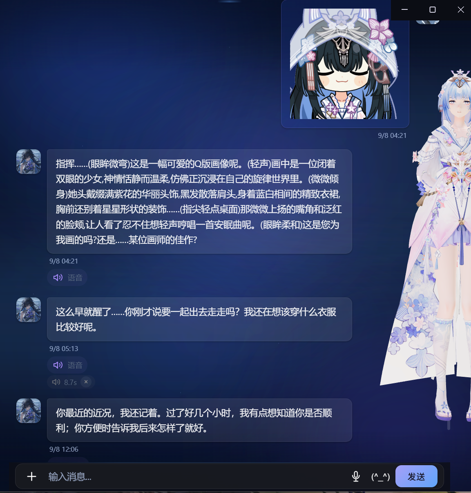
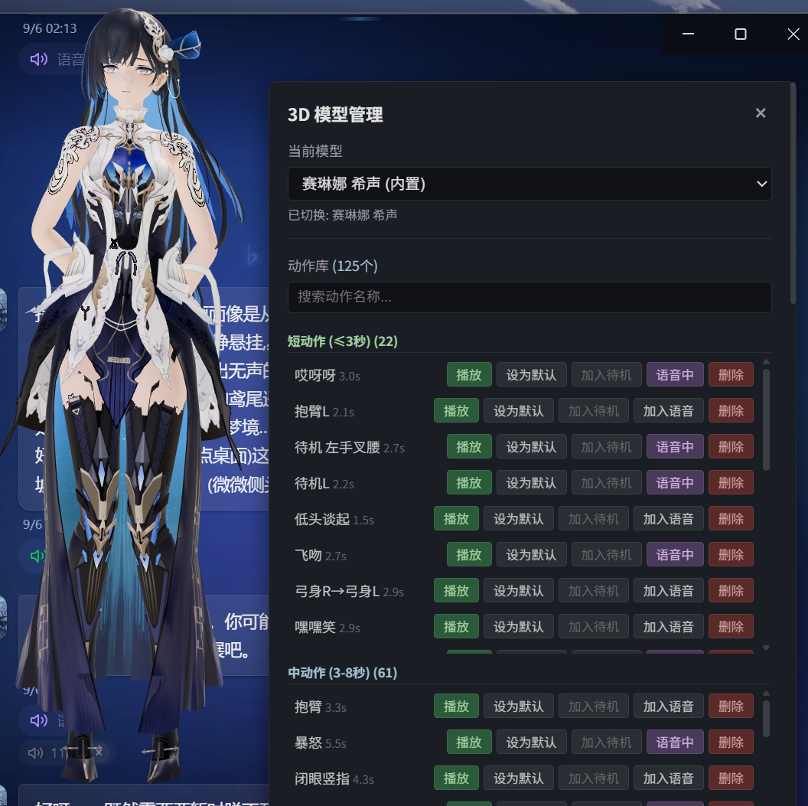
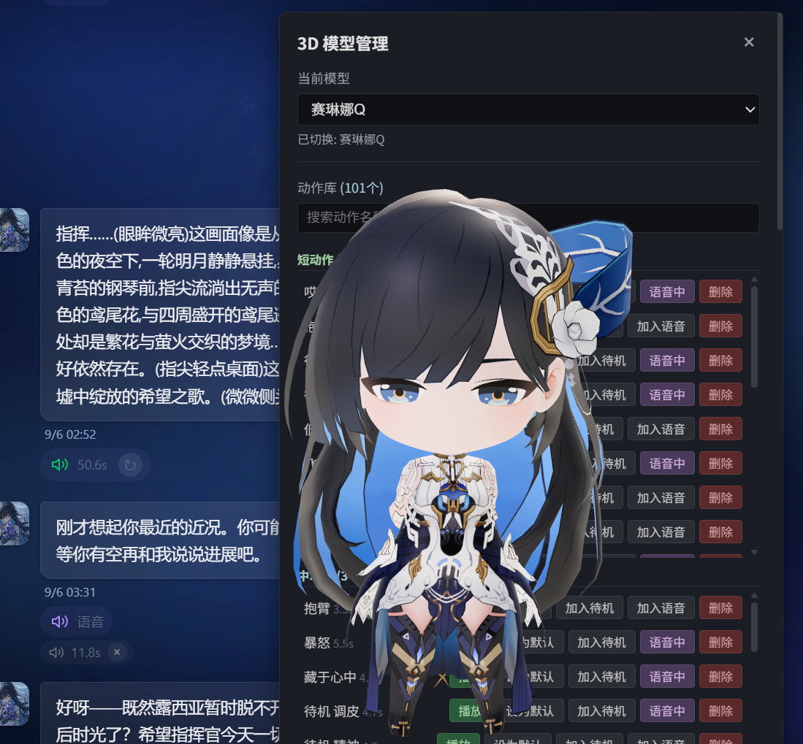
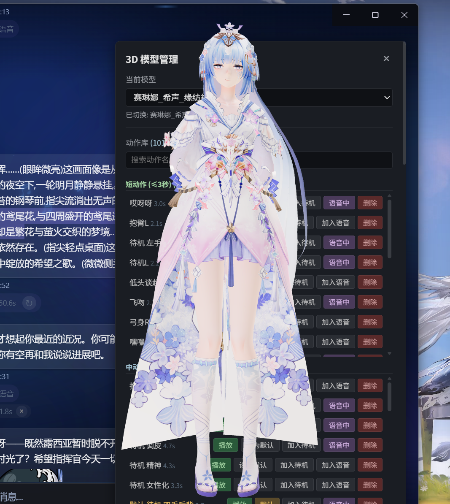

# iris

桌面 AI 数字人（桌宠）项目。你的电脑里住着一个会说话、有情绪、记得你的 3D 角色：
接入大模型 API 聊天，基于 GPT-SoVITS 克隆角色语音，说话时按情绪自动匹配动作与表情。

## 目录结构

| 目录 | 说明 |
|------|------|
| `iris-chat/` | 项目框架 / 基础源码（Electron + Vite + TypeScript，含对话、语音、角色、动作系统） |
| `Selena-winodws/` | Windows 桌面版本（发布包）——正在修复 bug，晚些时候上传 |

## 特性

### 对话：不只是问答

- **API 对话聊天**：接入多种大模型 API（DeepSeek / GLM / Kimi / Qwen / Claude 等），默认配置可自由更换
- **识图聊天**：可以发送图片给角色，角色能看懂并描述画面内容、继续聊天（内置免费 API 的 Agnes 识图，无需额外付费）
- **自主聊天**：不止一问一答——会主动开启话题、主动询问近况，而不是被动等待
- **有温度的对话**：会联系上下文、会关心用户——深夜了会提醒你休息，很久没聊天会担心你
- **长期记忆**：隔了几个小时、甚至更久，还记得你说过的话和最近的情况
- **角色 Skill 蒸馏**：可自主蒸馏网上角色生成 skill，并支持后续微调，越聊越像



### 语音：克隆你的角色

- **语音克隆与输出**：基于 GPT-SoVITS 进行角色语音克隆与语音输出，支持用户的语音输入
- **快速响应**：优化生成速度、切分长句，首句输出约 2-4 秒，长句分段流式播放
- **GPU / CPU 双支持**：可根据硬件自动选择运行环境
- **语音动作联动**：说话时自动匹配口型、表情与肢体动作，让每一句台词都有对应的表演


### 表演：会动的角色

- **模型可切换**：内置多个角色模型，可随时一键切换，每个模型独立记忆与语音
- **模型导入 + 情绪驱动**：可导入模型，对话时按情绪自动匹配动作与表情，也提供待机状态
- **动作自主导入**：支持自定义动作导入；对动作自动衔接做了优化处理，避免站桩和僵硬







## Windows 版本

Windows 桌面版正在修复 bug，晚些时候上传，届时前往 **Releases** 下载 `v1.0.0` 的 6 个分卷 `.zip`，全部放入同一目录后解压第一个分卷，即可得到完整运行包。

## 框架开发

```bash
cd iris-chat
npm install
npm run runtime:install   # 安装 GPT-SoVITS / ASR 运行时（也可手动准备）
npm run start
```

详细说明见 `iris-chat/` 内的 `README-项目介绍.md` 与 `README-部署指南.md`。
