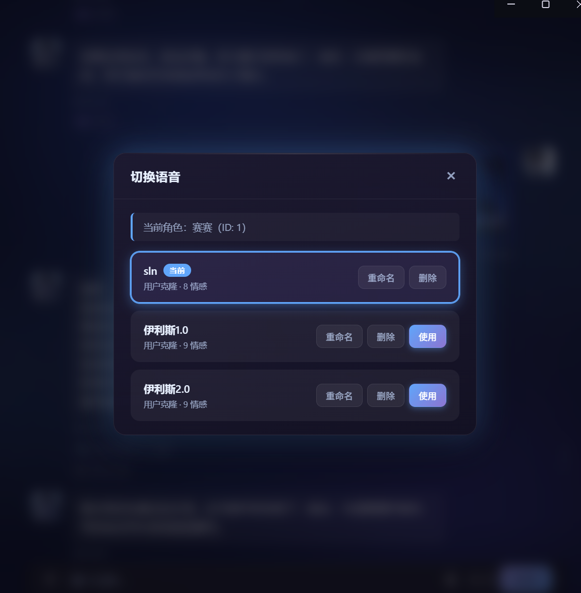
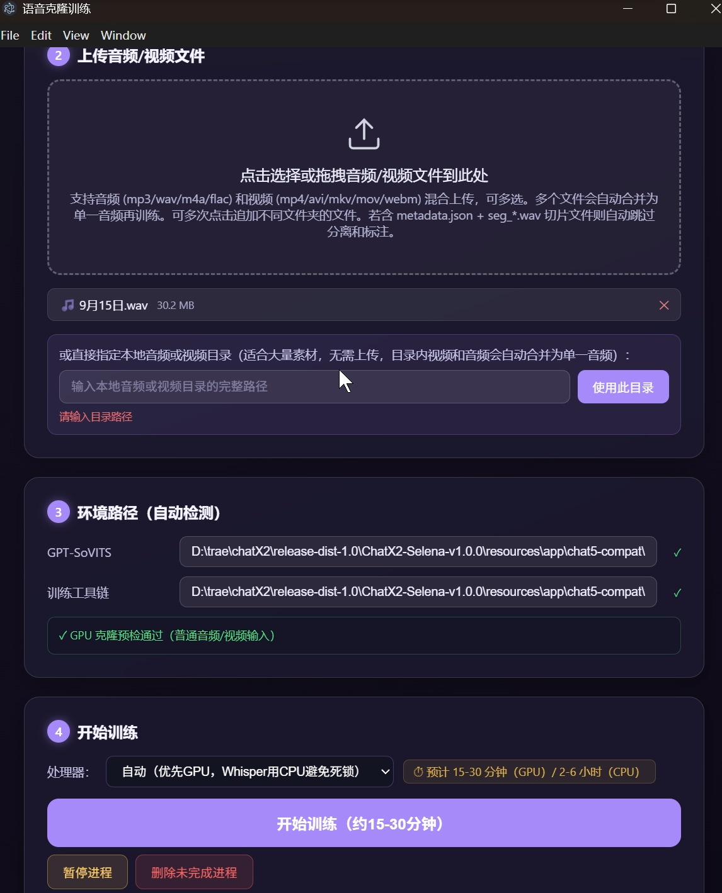
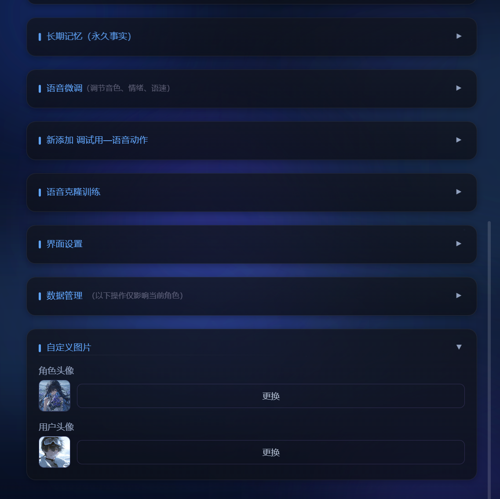
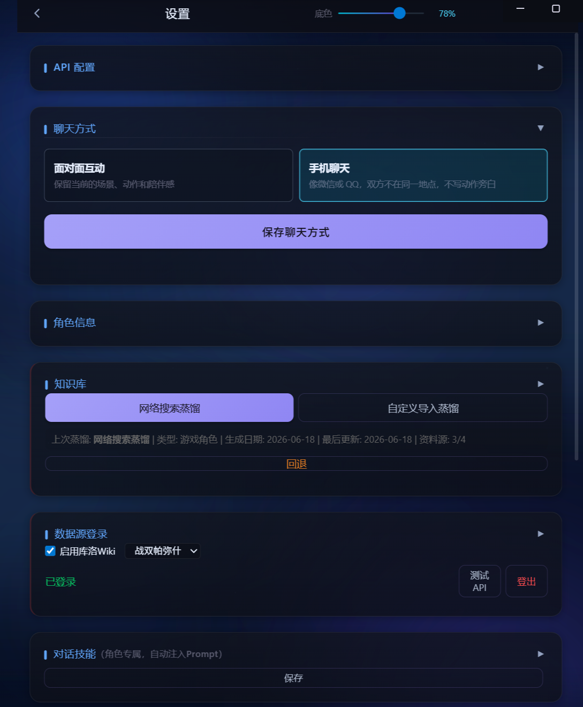
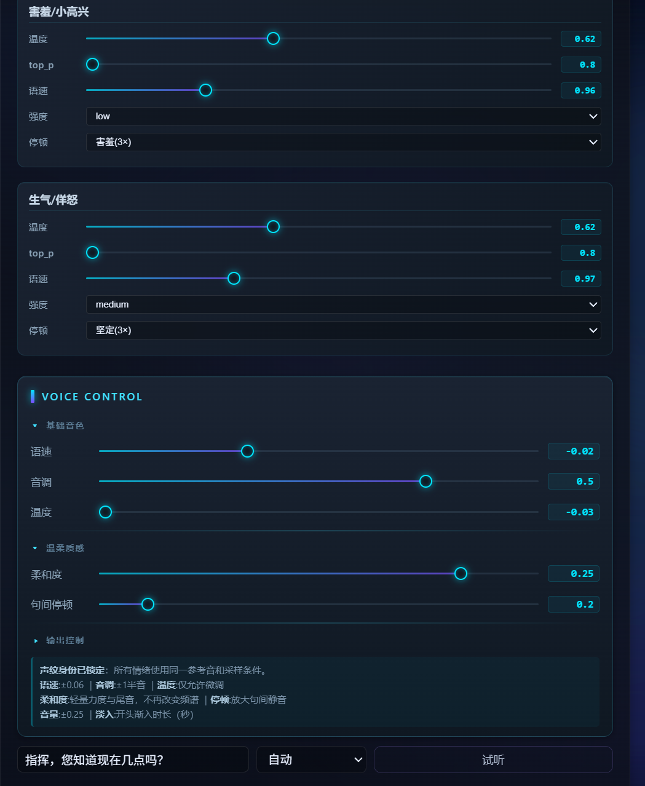
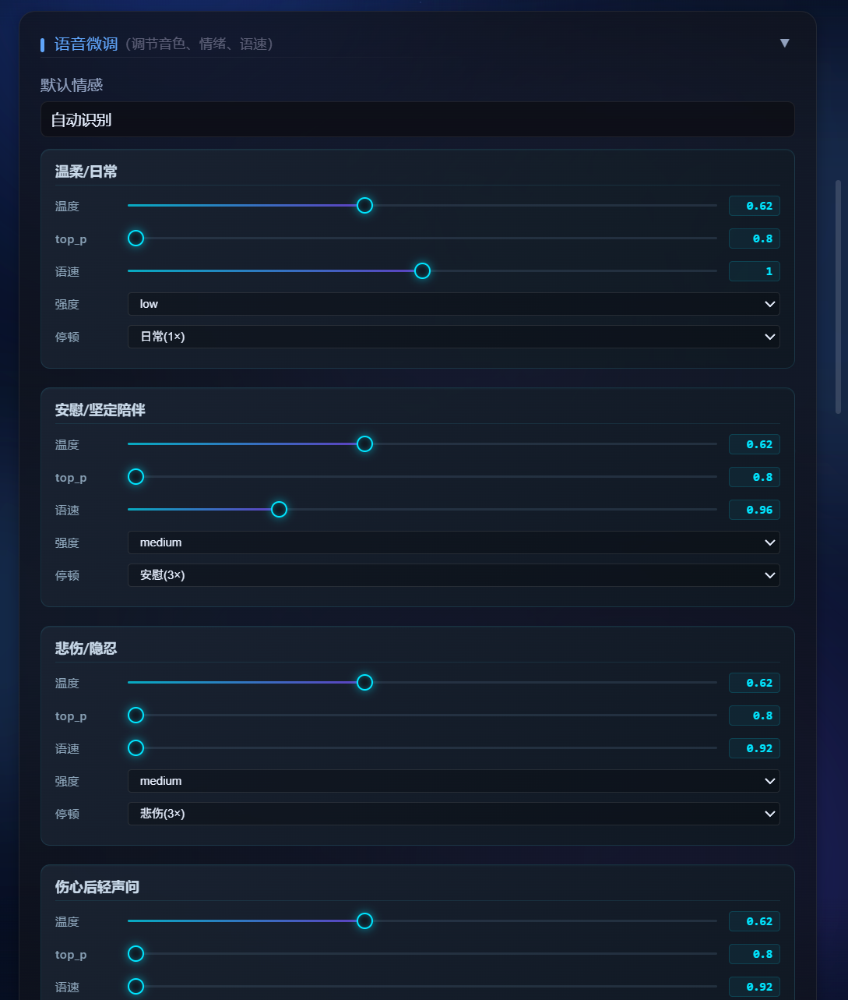

# iris

桌面 AI 数字人（桌宠）项目。你的电脑里住着一个会说话、有情绪、记得你的 3D 角色：
接入大模型 API 聊天，基于 GPT-SoVITS 克隆角色语音，说话时按情绪自动匹配动作与表情。

## 两种获取方式：完整可用版 vs 源码框架

本项目有两个形态，**普通用户直接下载 Selena 完整版就能用**；只有想二次开发、深入了解原理的开发者才需要源码框架。

### 1. Selena-winodws（完整可用版）—— 下载即用

> **✅ 推荐普通用户：不用装任何东西，下载即用**
>
> **从这里下载 →** **https://github.com/weihangan/iris/releases/tag/v1.1.0**

Windows 桌面版是**完整可运行**的项目：已经克隆《战双·赛琳娜》的语音、导入其多种角色模型，并内置蒸馏好的赛琳娜 skill（由几十万字符剧情、背景、网络介绍融合而成）。

- 免去装 Python 库、配置环境的所有麻烦，解压后即可启动桌宠
- **仅文字聊天需要接入 API（如 DeepSeek、免费 Agnes 等），消耗 token 极少**，并内置自动压缩与长期记忆，聊得再久也不易遗忘上下文
- 在 **Releases** 页 Assets 区域下载全部 9 个分卷 `Selena-winodws.zip.001~009`，放入同一目录，用 7-Zip 解压第一个分卷即可
- 需要旧版可下载 `v1.0.0`

### 2. iris-chat（源码框架）—— 需自行配置依赖

> **⚠️ 仅面向开发者/二次开发。跑起来需要：按文档用 AI 协助安装 Python 依赖库，并配置大模型 API 密钥。**

`iris-chat/` 是本项目的**基础源码框架**（Electron + Vite + TypeScript，含对话、语音、角色、动作系统）。它**不包含**赛琳娜等现成的语音克隆模型与 skill，需要你自己按 `iris-chat/` 内的 `README-项目介绍.md`、`README-部署指南.md` 操作：

1. `npm install` 安装前端依赖；
2. 按文档用 AI 下载安装 GPT-SoVITS / ASR 等 **Python 依赖库**（框架本身不含这些运行时）；
3. 在设置中配置大模型 API（DeepSeek / GLM / Kimi / Qwen / Claude 等）；
4. 用 `iris-chat/` 内的 skill 蒸馏流程，自己生成角色语音与 skill。

```bash
cd iris-chat
npm install
npm run runtime:install   # 安装 GPT-SoVITS / ASR 运行时（也可手动准备）
npm run start
```

### 快速选择

| 你的需求 | 选择 | 下载/操作方式 |
|---|---|---|
| 只想直接体验桌宠 | **Selena-winodws** | 到 Releases 下载 v1.1.0 分卷解压 |
| 想基于它改代码、换角色、深入学习 | **iris-chat** | 按 md 用 AI 装 Python 依赖 + 配模型 API |

---

## 目录结构

| 目录 | 说明 |
|------|------|
| `iris-chat/` | **源码框架**（Electron + Vite + TS）。需按文档用 AI 下载安装 Python 依赖库并配置大模型 API 才能运行，适合二次开发 |
| `Selena-winodws/` | **完整可用版**（下载即用）：已克隆《战双·赛琳娜》语音并导入其多模型的成品。下载指引见该目录，或直接去 **Releases** 下载分卷 |

---

## 特性

### 对话：不只是问答

- **API 对话聊天**：接入多种大模型 API（DeepSeek / GLM / Kimi / Qwen / Claude 等），默认配置可自由更换
- **识图聊天**：可以发送图片给角色，角色能看懂并描述画面内容、继续聊天（API 可自选，如可接入免费 Agnes；配合丰富的聊天规则 md + 角色蒸馏的 skill，可以最大限度地减小不同模型聊天能力的差距）
- **自主聊天**：不止一问一答——会主动开启话题、主动询问近况，而不是被动等待
- **有温度的对话**：会联系上下文、会关心用户——深夜了会提醒你休息，很久没聊天会担心你
- **长期记忆**：隔了几个小时、甚至更久，还记得你说过的话和最近的情况
- **记忆自动压缩**：聊天字数达到一定数量会自动压缩历史，同时保留情感线和长期记忆，对话再多也不断片
- **角色 Skill 蒸馏**：可自主蒸馏网上角色生成 skill，并支持后续微调，越聊越像

<p align="center">
  
</p>

### 语音：克隆你的角色

- **语音克隆与输出**：基于 GPT-SoVITS 进行角色语音克隆与语音输出，支持用户的语音输入。**注意**：训练用的原语音文件不宜太多，否则会导致语音生成不完全
- **真人化语音**：GPT-SoVITS 输出的语音自带真人说话的停顿与情感，不是机械的合成音，听感自然
- **快速响应**：优化生成速度、切分长句，首句输出约 2-3 秒，长句分段流式播放
- **GPU / CPU 双支持**：可根据硬件自动选择运行环境

<p align="center">
  
  
</p>

### 表演：会动的角色

- **模型可切换**：内置多个角色模型，可随时一键切换，每个模型独立记忆与语音
- **模型导入 + 情绪驱动**：可导入模型，对话时按情绪自动匹配动作与表情，也提供待机状态
- **动作自主导入**：支持自定义动作导入；对动作自动衔接做了优化处理，避免站桩和僵硬
- **语音动作联动**：说话时自动匹配口型、表情与肢体动作，让每一句台词都有对应的表演

<p align="center">
  
</p>

## 可自由导入切换模型

<p align="center">
  
  
  
</p>

## 设置

### 设置功能

<p align="center">
  
  
</p>

### 语言微调

<p align="center">
  
  
</p>

## v1.1.0 性能与内存优化

### 首次出声更快：LLM 边生成边合成

- **流式合成**：对话时大模型边生成、边切句、边合成语音，**首句一出就开始播放**，不再等整段回复生成完
- **首句约 2-3 秒出声**，后续句子按顺序流式播放，听感更自然连贯
- **句子完整性分段**：按句号/叹号/问号等句末标点切分（而非硬凑字数），首段不再被凑长，延迟明显下降

### 运行内存大幅下降

- **语音输入（ASR）改为按需启动**：不再开机预热常驻，首次使用时才启动
- **语音模型 fp32 → fp16**：BERT、SoVITS、GPT、BigVGAN 等以半精度加载，内存占用近乎减半
- **关闭 g2pw 多音字模型**：省下约 600MB 常驻内存（个别生僻多音字场景可手动开启）
- **BERT 直接按目标精度读盘**：跳过 fp32 全量加载的峰值内存
- **CPU 版限制 TTS 线程数**：降低内存占用；GPU 版不限制，保证合成速度

### 修复与稳定性

- **修复 IPv6 解析延迟**：解决 localhost 被解析为 IPv6 导致每次请求 2 秒静默延迟的问题

## 相关

- **完整版下载**：https://github.com/weihangan/iris/releases/tag/v1.1.0
- **源码框架开发文档**：`iris-chat/` 内的 `README-项目介绍.md` 与 `README-部署指南.md`
